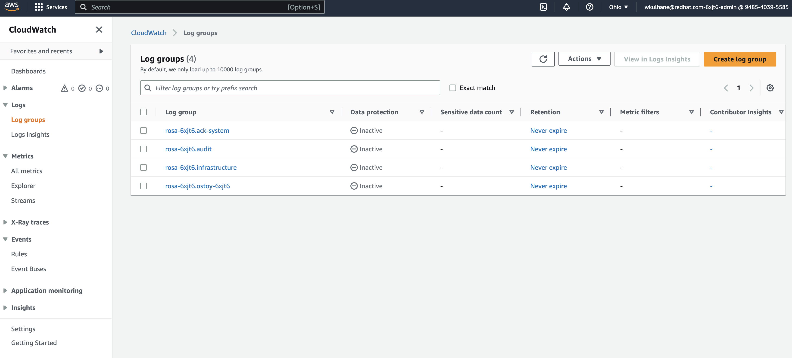

== Logging

Previously you set up log forwarding to the *AWS Cloudwatch* service. Now let's examine your `ostoy` application logs.

=== Output data to the streams/logs

. Output a message to _stdout_. In the `ostoy` application click on the _Home_ menu item and then click in the message box for "Log Message (stdout)" and write any message you want to output to the _stdout_ stream.
You can try "*All is well!*".
Then click "Send Message".
+
image::images/9-ostoy-stdout.png[Logging stdout]

. Output a message to _stderr_ Click in the message box for "Log Message (stderr)" and write any message you want to output to the _stderr_ stream.
You can try "*Oh no! Error!*".
Then click "Send Message".
+
image::images/9-ostoy-stderr.png[Logging stderr]

=== View application logs using `oc`

. Go to the CLI and enter the following command to retrieve the name of your frontend pod which we will use to view the pod logs:
+
[source,sh,role=execute]
----
oc logs -n ostoy-${GUID} deploy/ostoy-frontend
----
+
.Sample Output
[source,text,options=nowrap]
----
Version: 1.5.0
ostoy-frontend-84cbd867db-f2ggw: server starting on port 8080
If this is not running on AWS and/or you have no intention of using the ACK please ignore.
 - Error in accessing the ostoy-6xjt6-bucket, or it does not exist.
 - ACK feature disabled
stdout: All is well!
stderr: Oh no! Error!
----

=== View logs with CloudWatch

. Access the web console for your AWS account and go to CloudWatch. Open the URL %aws_web_console_url% in a new tab in your web browser. Login using the following credentials:

* Username: `%aws_web_console_user_name%`
* Password: `%aws_web_console_password%`

. In the *Search* bar at the top type `CloudWatch` and click on *CloudWatch* in the search results.

. Click on _Logs_ > _Log groups_ in the left menu to see the different groups of logs depending on what you selected during installation.
If you followed the previous steps you should see 4 groups.
One for `rosa-XXXXX.audit`, one for `rosa-XXXXX.infrastructure`, one for `rosa-XXXXX.ack-system` and finally your ostoy project `rosa-XXXX.ostoy-XXXX`.
+

. Click on `rosa-XXXX.ostoy-XXXX`.
. Click on the log stream for the newest "frontend" pod.
It will be titled something like `+kubernetes.var[...]ostoy-frontend-[...]+`
+
image::images/9-logstream.png[cloudwatch2]

. Filter for "stdout" and "stderr" the expand the row to show the message we had entered earlier along with much other information.
+
image::images/9-stderr.png[cloudwatch2]

. We can also see other messages in our logs from the app.
Enter "microservice" in the search bar, and expand one of the entries.
This shows us the color recieved from the microservice and which pod sent that color to our frontend pod.
+
image::images/9-messages.png[messages]

You can also use some of the other features of CloudWatch to obtain useful information.
But https://docs.aws.amazon.com/AmazonCloudWatch/latest/monitoring/WhatIsCloudWatch.html[how to use CloudWatch] is beyond the scope of this tutorial.
