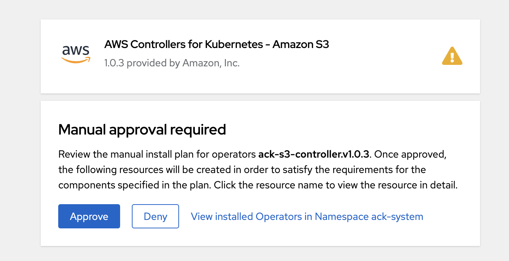

== Amazon Controller for Kubernetes (ACK)

The https://aws-controllers-k8s.github.io/community/docs/community/overview/[Amazon Controller for Kubernetes] (ACK) allows you to create and use AWS services directly from Kubernetes.
You can deploy your applications, including any required AWS services directly within the Kubernetes framework using a familiar structure to declaratively define and create AWS services like S3 buckets or RDS databases.

In order to illustrate the use of the ACK on ROSA, we will walk through a simple example of creating an S3 bucket, integrating that with OSToy, upload a file to it, and view the file in our application.
Interestingly, this part of the lab will also touch upon the concept of granting your applications access to AWS services (though that is worthy of a workshop of its own).

=== Section overview

To make the process clearer, here is an overview of the procedure we are going to follow.
There are two main "parts".

. *ACK Controller for the cluster* - This allows you to create/delete buckets in the S3 service through the use of a Kubernetes Custom Resource for the bucket.
 .. Install the controller (in our case an Operator) which will also create the required namespace and the service account.
 .. Run a script which will:
  ... Create the AWS IAM role for the ACK controller and assign the S3 policy
  ... Associate the AWS IAM role with the service account
. *Application access* - Granting access to our application container/pod to access our S3 bucket.
 .. Create a service account for the application
 .. Create an AWS IAM role for the application and assign the S3 policy
 .. Associate the AWS IAM role with the service account
 .. Update application deployment manifest to use the service account

=== Install an ACK controller

There are a few ways to do this, but we will use an Operator to make it easy.
The Operator installation will also create an `ack-system` namespace and a service account `ack-s3-controller` for you.

. Login to your OpenShift cluster's web console (if you aren't already).
. On the left menu, click on "Operators > OperatorHub".
. In the filter box enter "S3" and select the "AWS Controller for Kubernetes - Amazon S3"
+
image::images/13-ack-operator.png[create]

. If you get a pop-up saying that it is a community operator, just click "Continue".
. Click "Install" in the top left.
. Ensure that "All namespaces on the cluster" is selected for "Installation mode".
. Ensure that "ack-system" is selected for "Installed Namespace".
. Under "Update approval" ensure that "Manual" is selected.
+
[WARNING]
====
Make sure to select "Manual Mode" so that changes to the Service Account do not get overwritten by an automatic operator update.
====

. Click "Install" on the bottom.
The settings should look like the below image.
+
image::images/13-ack-install.png[create_s3_controller]

. Approve the operator installation. Click the *Approve* button.
+

. You will see that installation is taking place.
The installation won't complete until the next step is finished.
So please proceed.

=== Set up access for the controller

To deploy a service in your AWS account our ACK controller will need credentials for those AWS services (or S3 in our case).
There are a few options for doing so, but the recommended approach is to use https://docs.aws.amazon.com/eks/latest/userguide/iam-roles-for-service-accounts.html[IAM Roles for Service Accounts] (IRSA) that automates the management and rotation of temporary credentials that the service account can use.
As stated on the https://aws-controllers-k8s.github.io/community/docs/user-docs/irsa/[ACK documentation page]:

____
Instead of creating and distributing your AWS credentials to the containers or using the Amazon EC2 instance's role, you can associate an IAM role with a Kubernetes service account.
The applications in a Kubernetes pod container can then use an AWS SDK or the AWS CLI to make API requests to authorized AWS services.
____

To get the credentials, pods receive a valid OIDC JSON web token (JWT) and pass it to the AWS STS `AssumeRoleWithWebIdentity` API operation in order to receive IAM temporary role credentials.

The mechanism behind IRSA/STS in ROSA relies on the EKS pod identity mutating webhook which modifies pods that require AWS IAM access.
Since we are using ROSA w/STS this webhook is already installed.

[NOTE]
====
Using IRSA allows us to adhere to the following best practices:

. *Principle of least privilege* - We are able to create finely tuned IAM permissions for AWS roles that only allow the access required.  Furthermore, these permissions are limited to the service account associated with the role and therefore only pods that use that service account have access.
. *Credential Isolation* - a pod can only retrieve credentials for the IAM role associated with the service account that the pod is using and no other.
. *Auditing* - In AWS, any access of AWS resources can be viewed in CloudTrail.
====

Usually one would need to provision an OIDC provider, but since one is deployed with ROSA w/STS we can use that one.

==== Create an IAM role and policy for the ACK controller

. Create a new directory on your local machine to work from.
Name it as you'd like.
+
[source,sh,role=execute]
----
mkdir $HOME/rosaworkshop && cd $HOME/rosaworkshop
----

. Download the `setup-s3-ack-controller.sh` script which automates the process for you:
+
[source,sh,role=execute]
----
wget https://raw.githubusercontent.com/openshift-cs/rosaworkshop/master/rosa-workshop/ostoy/resources/setup-s3-ack-controller.sh
----
+
Don't worry, you will perform these steps later (for the application) but basically the script creates an AWS IAM role with an AWS S3 policy and associates that IAM role with the service account.
Feel free to read the script.

. Run the script:
+
[source,sh,role=execute]
----
chmod +x ./setup-s3-ack-controller.sh

./setup-s3-ack-controller.sh
----
+
.Sample Output
[source,text,options=nowrap]
----
Confirming that the ack-s3-controller operator is present...ok.
"ack-s3-user-config" ConfigMap created.
IAM role ack-s3-controller created.
Attaching IAM policy to ack-s3-controller.
Attaching arn:aws:iam::aws:policy/AmazonS3FullAccess ... ok.
Annotated service account.
Operator deployment restarting...
Error from server (NotFound): pods "ack-s3-controller" not found
...Not ready yet

[...Output omitted...]
----

. When the script is complete it will restart the deployment which will update the service controller pods with the IRSA environment variables.

. Confirm that the environment variables are set. Run:
+
[source,sh,role=execute]
----
oc describe pod ack-s3-controller -n ack-system | grep "^\s*AWS_"
----
+
.Sample Output
[source,text,options=nowrap]
----
      AWS_ROLE_ARN:                 arn:aws:iam::948540395585:role/ack-s3-controller
      AWS_WEB_IDENTITY_TOKEN_FILE:  /var/run/secrets/eks.amazonaws.com/serviceaccount/token
----

. The ACK controller should now be set up successfully.
You can confirm this in the OpenShift Web Console under "Operators > Installed operators".
+
image::images/13-ack-oper-installed.png[success]
+
[INFO]
====
If after a minute you still do not see the Operator installation as successful and you do not see the IRSA environment variables, you may need to manually restart the deployment:

`oc rollout restart deployment ack-s3-controller -n ack-system`
====

We can now create/delete buckets through Kubernetes using the ACK.

In the next section we will enable our application to use the S3 bucket that we will create.

=== Set up access for our application

In this section we will create an AWS IAM role and service account so that OSToy can read and write objects to the S3 bucket that we will create.

. Before starting, ensure that you are in your OSToy project.
If your project is named differently, then use the name for your project.
+
[source,sh,role=execute]
----
oc project ostoy-${GUID}
----
+
.Sample Output
[source,text,options=nowrap]
----
Now using project "ostoy-6xjt6" on server "https://api.rosa-6xjt6.qkm6.p1.openshiftapps.com:6443".
----

==== Create an AWS IAM role

. Get your AWS account ID
+
[source,sh,role=execute]
----
export AWS_ACCOUNT_ID=$(aws sts get-caller-identity --query Account --output text)
----

. Get the OIDC provider
+
[source,sh,role=execute]
----
export OIDC_PROVIDER=$(oc get authentication.config.openshift.io cluster -o jsonpath='{.spec.serviceAccountIssuer}' | sed 's/https:\/\///')
----

. Get the current namespace
+
[source,sh,role=execute]
----
export OSTOY_NAMESPACE=$(oc config view --minify -o 'jsonpath={..namespace}')
----

. Create the trust policy file.
+
[source,sh,role=execute]
----
cat <<EOF > $HOME/rosaworkshop/ostoy-sa-trust.json
{
  "Version": "2012-10-17",
  "Statement": [
    {
      "Effect": "Allow",
      "Principal": {
        "Federated": "arn:aws:iam::${AWS_ACCOUNT_ID}:oidc-provider/${OIDC_PROVIDER}"
      },
      "Action": "sts:AssumeRoleWithWebIdentity",
      "Condition": {
        "StringEquals": {
          "${OIDC_PROVIDER}:sub": "system:serviceaccount:${OSTOY_NAMESPACE}:ostoy-s3-sa"
        }
      }
    }
  ]
}
EOF
----

. Create the AWS IAM role to be used with your service account:
+
[source,sh,role=execute]
----
aws iam create-role --role-name "ostoy-s3-sa-role" --assume-role-policy-document file://${HOME}/rosaworkshop/ostoy-sa-trust.json
----
+
.Sample Output
[source,json,options=nowrap]
----
{
    "Role": {
        "Path": "/",
        "RoleName": "ostoy-s3-sa-role",
        "RoleId": "AROA5ZWLJ2BA4TYR36T3D",
        "Arn": "arn:aws:iam::948540395585:role/ostoy-s3-sa-role",
        "CreateDate": "2023-04-26T18:15:26+00:00",
        "AssumeRolePolicyDocument": {
            "Version": "2012-10-17",
            "Statement": [
                {
                    "Effect": "Allow",
                    "Principal": {
                        "Federated": "arn:aws:iam::948540395585:oidc-provider/rh-oidc.s3.us-east-1.amazonaws.com/23beo51t4uh3etgvujh0gngcncrgfbro"
                    },
                    "Action": "sts:AssumeRoleWithWebIdentity",
                    "Condition": {
                        "StringEquals": {
                            "rh-oidc.s3.us-east-1.amazonaws.com/23beo51t4uh3etgvujh0gngcncrgfbro:sub": "system:serviceaccount:ostoy-6xjt6:ostoy-s3-sa"
                        }
                    }
                }
            ]
        }
    }
}
----

==== Attach the S3 policy to the IAM role

. Get the Full Access policy ARN:
+
[source,sh,role=execute]
----
export POLICY_ARN=$(aws iam list-policies  --query 'Policies[?PolicyName==`AmazonS3FullAccess`].Arn' --output text)
----

. Attach that policy to the AWS IAM role:
+
[source,sh,role=execute]
----
aws iam attach-role-policy --role-name "ostoy-s3-sa-role" --policy-arn "${POLICY_ARN}"
----

==== Create the service account for our pod

. Get the ARN for the AWS IAM role we created so that it will be included as an annotation when creating our service account.
+
[source,sh,role=execute]
----
export APP_IAM_ROLE_ARN=$(aws iam get-role --role-name=ostoy-s3-sa-role --query Role.Arn --output text)
----

. Create the service account manifest. Note the annotation to reference our AWS IAM role.
+
[source,sh,role=execute]
----
cat <<EOF >$HOME/rosaworkshop/ostoy-serviceaccount.yaml
---
apiVersion: v1
kind: ServiceAccount
metadata:
  name: ostoy-s3-sa
  namespace: ostoy-${GUID}
  annotations:
    eks.amazonaws.com/role-arn: "$APP_IAM_ROLE_ARN"
EOF
----

. Create the service account:
+
[source,sh,role=execute]
----
oc create -f $HOME/rosaworkshop/ostoy-serviceaccount.yaml
----
+
.Sample Output
[source,text,options=nowrap]
----
serviceaccount/ostoy-s3-sa created
----

. Confirm that is was successful:
+
[source,sh,role=execute]
----
oc describe serviceaccount ostoy-s3-sa -n ostoy-${GUID}
----
+
.Sample Output
[source,text,options=nowrap]
----
Name:                ostoy-s3-sa
Namespace:           ostoy-6xjt6
Labels:              <none>
Annotations:         eks.amazonaws.com/role-arn: arn:aws:iam::948540395585:role/ostoy-s3-sa-role
Image pull secrets:  ostoy-s3-sa-dockercfg-9h8z7
Mountable secrets:   ostoy-s3-sa-dockercfg-9h8z7
Tokens:              ostoy-s3-sa-token-r5z4f
Events:              <none>
----

=== Create an S3 bucket

. Create a manifest file for your bucket.
+
[source,sh,role=execute]
----
cat << EOF >$HOME/rosaworkshop/s3-bucket.yaml
---
apiVersion: s3.services.k8s.aws/v1alpha1
kind: Bucket
metadata:
  name: ostoy-${GUID}-bucket
  namespace: ostoy-${GUID}
spec:
  name: ostoy-${GUID}-bucket
EOF
----

. Create the bucket:
+
[source,sh,role=execute]
----
oc create -f $HOME/rosaworkshop/s3-bucket.yaml
----
+
.Sample Output
[source,text,options=nowrap]
----
bucket.s3.services.k8s.aws/ostoy-6xjt6-bucket created
----

. Confirm the bucket was created:
+
[source,sh,role=execute]
----
aws s3 ls | grep ostoy-bucket
----
+
.Sample Output
[source,text,options=nowrap]
----
2023-04-26 18:24:16 ostoy-6xjt6-bucket
----

=== Redeploy the OSToy app with the new service account

. Patch the `ostoy-frontend` deployment to use the service account that you just created:
+
[source,sh,role=execute]
----
oc patch deploy ostoy-frontend -n ostoy-${GUID} --type=merge --patch '{"spec": {"template": {"spec":{"serviceAccount":"ostoy-s3-sa"}}}}'
----
+
.Sample Output
[source,text,options=nowrap]
----
deployment.apps/ostoy-frontend patched
----

. Give it a minute to update the pod.

=== Confirm that the IRSA environment variables are set

When AWS clients or SDKs connect to the AWS APIs, they detect `AssumeRoleWithWebIdentity` security tokens to assume the IAM role.
See the https://docs.aws.amazon.com/STS/latest/APIReference/API_AssumeRoleWithWebIdentity.html[AssumeRoleWithWebIdentity] documentation for more details.

. As we did for the ACK controller we can use the following command to describe the pods and verify that the `AWS_WEB_IDENTITY_TOKEN_FILE` and `AWS_ROLE_ARN` environment variables exist for our application which means that our application can successfully authenticate to use the S3 service:
+
[source,sh,role=execute]
----
oc describe pod ostoy-frontend -n ostoy-${GUID} | grep "^\s*AWS_"
----
+
.Sample Output
[source,text,options=nowrap]
----
      AWS_ROLE_ARN:                 arn:aws:iam::948540395585:role/ostoy-s3-sa-role
      AWS_WEB_IDENTITY_TOKEN_FILE:  /var/run/secrets/eks.amazonaws.com/serviceaccount/token
----

=== See the bucket contents through OSToy

Use our app to see the contents of our S3 bucket.

. Switch to the browser tab for the OSToy application and hit refresh.
. A new menu item will appear.
Click on "ACK S3" in the left menu in OSToy.
. You will see a page that lists the contents of the bucket, which at this point should be empty.
+
image::images/13-ack-views3contents.png[view bucket]

. Move on to the next step to add some files.

=== Create files in your S3 bucket

For this step we will use OStoy to create a file and upload it to the S3 bucket.
While S3 can accept any kind of file, for this workshop we'll use text files so that the contents can easily be rendered in the browser.

. Click on "ACK S3" in the left menu in OSToy.
. Scroll down to the section underneath the "Existing files" section, titled "Upload a text file to S3".
. Enter a file name for your file.
. Enter some content for your file.
. Click "Create file".
+
image::images/13-ack-creates3obj.png[create file]

. Scroll up to the top section for existing files and you should see your file that you just created there.
. Click on the file name to view the file.
+
image::images/13-ack-viewobj.png[viewfilecontents]

. Now to confirm that this is not just some smoke and mirrors, let's confirm directly via the AWS CLI.
Run the following to list the contents of our bucket.
+
[source,sh,role=execute]
----
aws s3 ls s3://ostoy-${GUID}-bucket
----
+
.Sample Output
[source,text,options=nowrap]
----
2023-04-26 18:34:23         27 OSToy.txt
----
